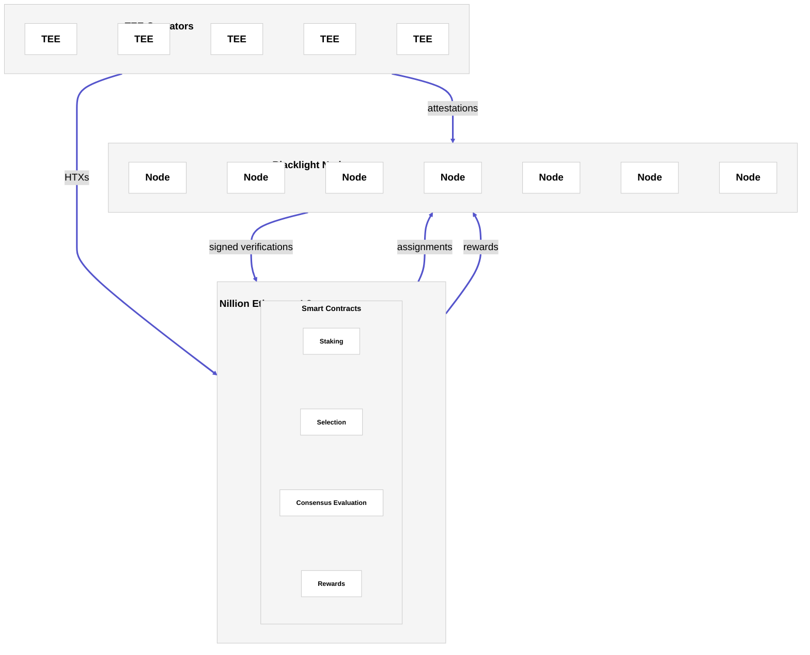

# Architecture

## Overview

Nillion Blacklight is a decentralised verification network designed to continuously verify workloads running inside trusted execution environments (TEEs). The system is composed of three core components that work together to provide ongoing, credibly neutral verification.

* TEE Operators run workloads inside TEEs and submit proofs of liveness (that we call heartbeat transactions - HTXs).
* [**Nillion's Ethereum L2**](/blacklight/verify/network) coordinates verification, consensus, and rewards. Verification coordination is realised by the L2 assigning Blacklight nodes HTXs they should verify.
* Blacklight nodes independently challenge and verify TEE attestations.

 

Together, these components enable continuous, decentralised verification of TEE-backed workloads. In doing so, they act as a credibly neutral trust layer for TEEs.

The central concept underpinning Nillion Blacklight is that of the heartbeat transaction (HTX), a periodic, workload-level proof of liveness submitted by TEE operators that signals a workload is still running inside a real enclave and is ready to be independently verified by the network.

## TEE Operators

TEE operators (such as [nilCC](/blind-computer/build/compute/overview) node operators) run workloads inside Trusted Execution Environments. For each active workload, operators periodically submit heartbeat transactions (HTXs) to [Nillion's Ethereum L2](/blacklight/verify/network). These heartbeats assert that the workload is still running and provide the metadata required for the network to independently verify its execution.

## Nillion's Ethereum L2

[Nillion's Ethereum L2](/blacklight/verify/network) acts as the coordination and settlement layer for Nillion Blacklight. It receives heartbeat transactions (HTXs) from TEE operators and assigns each HTX to a committee of Blacklight nodes selected in a stake-weighted, probabilistic way. After the assigned Blacklight nodes verify the workload and submit their signed results back to the L2, the L2 evaluates whether the committee has reached consensus.

Consensus is determined using two stake-weighted conditions: a quorum requirement (enough of the committee’s total stake has responded) and a threshold requirement (enough of the committee’s total stake agrees on the same outcome). Once these conditions are met, the L2 finalises the verification result for the HTX and distributes rewards from the reward pool (which Blacklight nodes can then claim).

## Blacklight Nodes

[Blacklight nodes](/blacklight/verify/run-node) are permissionless verifier nodes that perform the core verification work of the network. When assigned a HTX, a Blacklight node retrieves the workload’s attestation report directly from the TEE operator and independently verifies its authenticity and correctness.

Each node submits a signed verification result back to the L2. Once consensus is reached, nodes that contributed to the finalised outcome are eligible for rewards.
