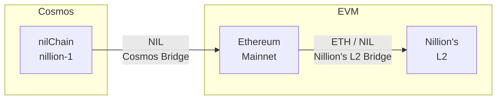

# Bridging to Nillion's Ethereum L2

Bridging allows you to transfer assets between Nillion's Ethereum L2 and other networks. This **Mainnet** guide covers the available bridges for moving assets to and from Nillion's L2. For **Testnet**, we recommend going directly to the [faucet](../tools/faucets.md).

## From Cosmos to Ethereum

You can bridge `NIL` tokens from nilChain (Cosmos) to Ethereum using our [Cosmos-Ethereum bridge](https://migrate.nillion.com/).

To bridge NIL from Cosmos to Ethereum:

1. Visit the [Cosmos-Ethereum bridge](https://migrate.nillion.com/)
2. Connect your wallets - both on the Cosmos and EVM side
3. Note: The source chain (nilChain `nillion-1`), destination chain (Ethereum `1`), source asset (NIL), and destination asset are pre-populated
4. Enter the amount of `NIL` you want to bridge
5. Review and confirm the transaction

The bridge will handle the cross-chain transfer and your NIL tokens will be available on Ethereum once the transaction is complete.

Watch the video below for a run through on how to bridge NIL from Cosmos to Ethereum.

<iframe width="560" height="315" src="https://www.youtube.com/embed/LHTjCh9-dMs?si=9GZvnEmIRJgVbeOz" title="YouTube video player" frameborder="0" allow="accelerometer; autoplay; clipboard-write; encrypted-media; gyroscope; picture-in-picture; web-share" referrerpolicy="strict-origin-when-cross-origin" allowfullscreen></iframe>

---

## From Ethereum to Nillion's Ethereum L2

You can bridge assets from `Ethereum Mainnet` to `Nillion's Ethereum L2` using the [official bridge](https://bridge.nillion.network/).

### Bridge ETH from Ethereum

To bridge `ETH` from Ethereum to Nillion's L2:

1. Visit [Nillion's Mainnet Bridge](https://bridge.nillion.network/)
2. Connect your wallet
3. Ensure `Ethereum` is the source chain and `Nillion` is the destination
4. Enter the amount of `ETH` you want to bridge
5. Review and confirm the transaction

Once the bridge transaction is confirmed, your ETH will be available on Nillion's L2.

### Bridge NIL from Ethereum

To bridge `NIL` tokens from Ethereum to Nillion's L2:

1. Visit [Nillion's Mainnet Bridge](https://bridge.nillion.network/)
2. Connect your wallet
3. Ensure `Ethereum` is the source chain and `Nillion` is the destination
4. Select `NIL` as the token to bridge
5. Enter the amount of `NIL` you want to bridge
6. Review and confirm the transaction

Your NIL tokens will be available on Nillion's L2 after the bridge transaction is confirmed.
