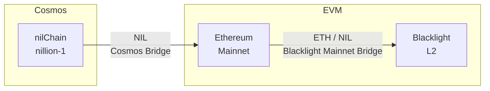

# Bridging to Blacklight

Bridging allows you to transfer assets between Blacklight and other networks. This **Mainnet** guide covers the available bridges for moving assets to and from Blacklight. For **Testnet**, we recommend going directly to the [faucet](../tools/faucets.md).

## From Cosmos to Ethereum

You can bridge `NIL` tokens from nilChain (Cosmos) to Ethereum using our [Cosmos-Ethereum](coming.soon) bridge. 

### Bridge NIL from Cosmos

The [Cosmos-Ethereum](coming.soon) bridge allows you to transfer `NIL` between nilChain (Cosmos) and Ethereum.

To bridge NIL from Cosmos to Ethereum:

1. Visit the [Cosmos-Ethereum](coming.soon) bridge
2. Connect your wallet (supports both Cosmos and EVM wallets)
3. The source chain (nilChain `nillion-1`), destination chain (Ethereum `1`), source asset (NIL), source asset, and destination asset are pre-populated from the link
4. Enter the amount of `NIL` you want to bridge
5. Review and confirm the transaction

The bridge will handle the cross-chain transfer and your NIL tokens will be available on Ethereum once the transaction is complete.

---

## From Ethereum to Blacklight

You can bridge assets from `Ethereum Mainnet` to `Blacklight Mainnet` using the official bridge.

### Bridge ETH from Ethereum

To bridge `ETH` from Ethereum to Blacklight:

1. Visit the [Blacklight Mainnet Bridge](coming.soon)
2. Connect your wallet
3. Ensure `Ethereum` is the source chain and `Nillion` is the destination
4. Enter the amount of `ETH` you want to bridge
5. Review and confirm the transaction

Once the bridge transaction is confirmed, your ETH will be available on Blacklight Mainnet.

### Bridge NIL from Ethereum

To bridge `NIL` tokens from Ethereum to Blacklight:

1. Visit the [Blacklight Mainnet Bridge](coming.soon)
2. Connect your wallet
3. Ensure `Ethereum` is the source chain and `Nillion` is the destination
4. Select `NIL` as the token to bridge
5. Enter the amount of `NIL` you want to bridge
6. Review and confirm the transaction

Your NIL tokens will be available on Blacklight Mainnet after the bridge transaction is confirmed.
