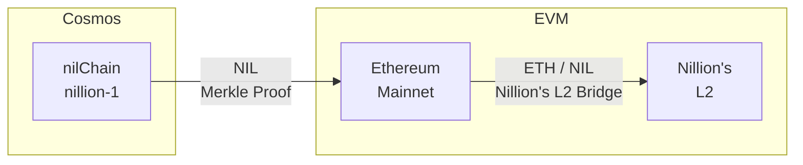

# Bridging to Nillion's Ethereum L2

Bridging allows you to transfer assets between Nillion's Ethereum L2 and other networks. This **Mainnet** guide covers the available bridges for moving assets to and from Nillion's L2. For **Testnet**, we recommend going directly to the [faucet](../tools/faucets.md).

```mermaid
flowchart LR
    subgraph Cosmos
        NC[nilChain<br/>nillion-1]
    end

    subgraph EVM
        ETH[Ethereum<br/>Mainnet]
        BL[Nillion's<br/>L2]
    end

    NC -->|NIL<br/>Merkle Proof | ETH
    ETH -->|ETH / NIL<br/>Nillion's L2 Bridge| BL
```

## From Cosmos to Ethereum

The NilChain was halted on March 23rd at 14:18 UTC (block #6,222,000), and a final snapshot of all remaining balances was taken.
If you still had an unbridged balance at that point, your tokens have been pre-minted on Ethereum and can be claimed once using a Merkle proof:

1. Visit the [Cosmos-Ethereum claim page](https://claim.nillion.com/)
2. Connect your wallets - both on the Cosmos and EVM side
3. Sign with your Cosmos wallet
4. Claim your NIL on Ethereum - the whole balance will be claimed

Your NIL tokens will be available on Ethereum once the transaction is complete.

---

## From Ethereum to Nillion's Ethereum L2

You can bridge assets from `Ethereum Mainnet` to `Nillion's Ethereum L2` using the [official bridge](https://bridge.nillion.network/).

### Bridge ETH from Ethereum

To bridge `ETH` from Ethereum to Nillion's L2:

1. Visit [Nillion's Mainnet Bridge](https://bridge.nillion.network/)
2. Connect your wallet
3. Ensure `Ethereum` is the source chain and `Nillion` is the destination
4. Enter the amount of `ETH` you want to bridge
5. Review and confirm the transaction

Once the bridge transaction is confirmed, your ETH will be available on Nillion's L2.

<iframe width='100%' height='500' src="https://www.youtube.com/embed/0GlgxIk2KYk?si=Si6-PEUjoWQx-mWj" title="YouTube video player" frameborder="0" allow="accelerometer; autoplay; clipboard-write; encrypted-media; gyroscope; picture-in-picture; web-share" referrerpolicy="strict-origin-when-cross-origin" allowfullscreen></iframe>

### Bridge NIL from Ethereum

To bridge `NIL` tokens from Ethereum to Nillion's L2:

1. Visit [Nillion's Mainnet Bridge](https://bridge.nillion.network/)
2. Connect your wallet
3. Ensure `Ethereum` is the source chain and `Nillion` is the destination
4. Select `NIL` as the token to bridge
5. Enter the amount of `NIL` you want to bridge
6. Review and confirm the transaction

Your NIL tokens will be available on Nillion's L2 after the bridge transaction is confirmed.
