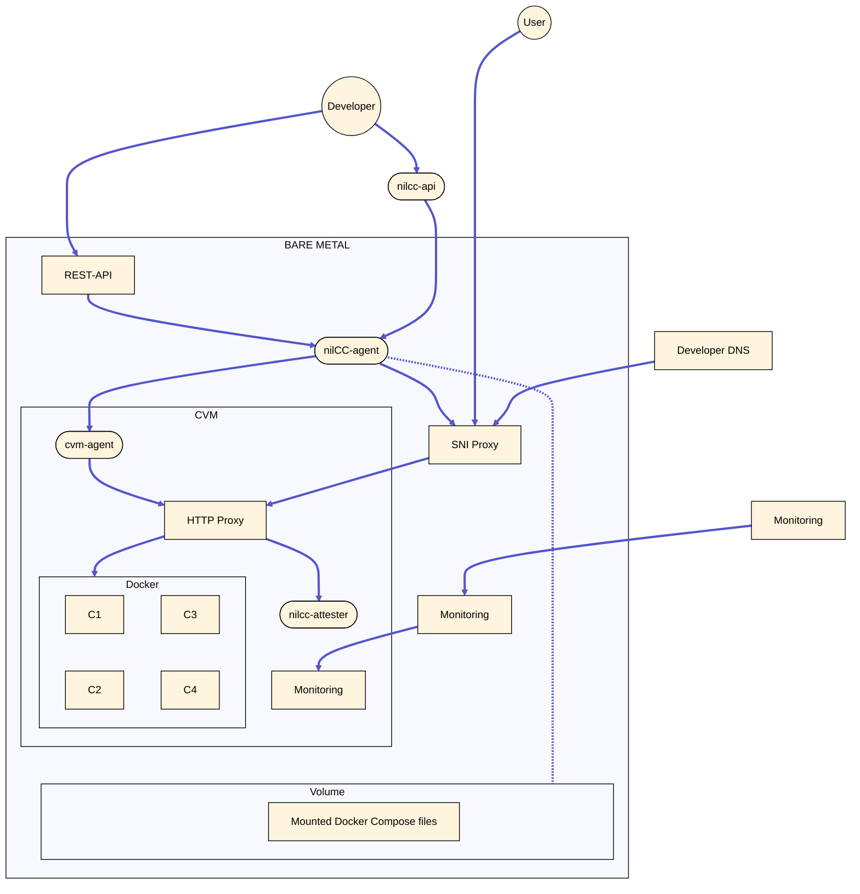

# nilCC Architecture

## System Overview

nilCC is a distributed system composed of several interconnected components that work together to provide secure, verifiable computation in trusted execution environments. The architecture is designed to separate concerns between workload management, secure execution, and user interaction.

## Core Components

### nilcc-api

The [nilcc-api](https://github.com/NillionNetwork/nilcc/tree/main/nilcc-api) serves as the central control plane, providing the public interface for workload management and coordination across the entire nilCC infrastructure.

- **Primary Functions**
  - **User Interface**: Provides REST API endpoints for workload creation, management, and monitoring
  - **Agent Coordination**: Orchestrates multiple nilcc-agent instances across different bare metal hosts
  - **Event Processing**: Receives and processes status updates, errors, and events from agents
  - **Resource Allocation**: Makes decisions about workload placement based on available resources
- **Integration Points**
  - **Upward to Users/UI**: Serves the nilcc-ui dashboard and external API clients
  - **Downward to Agents**: Communicates with registered nilcc-agent instances using authentication tokens

This centralized design allows users to manage workloads across multiple physical hosts through a single, consistent API while maintaining security through token-based authentication.

### nilcc-agent

The [nilcc-agent](https://github.com/NillionNetwork/nilcc/tree/main/nilcc-agent) is the workload orchestrator that runs on each bare metal machine in the nilCC infrastructure. It serves as the bridge between the public API and the actual confidential VMs.

- **Responsibilities**
  - **CVM Lifecycle Management**: Creates, starts, stops, and deletes Confidential VMs based on workload requirements
  - **Resource Management**: Tracks CPU, memory, GPU, and disk allocation to prevent overcommitment
  - **Monitoring & Reporting**: Monitors VM health and reports status/errors to nilcc-api
  - **Log & Metrics Collection**: Retrieves logs and system statistics from running CVMs
- **Communication**
  - **Upward to nilcc-api**: Registers on startup with a unique API token for authenticated communication
  - **Downward to cvm-agent**: Communicates with each VM's cvm-agent via a local-only HTTP API
  - **Security**: All API communication uses authentication tokens passed within HTTP headers

### cvm-agent

The [cvm-agent](https://github.com/NillionNetwork/nilcc/tree/main/cvm-agent) runs as a systemd daemon inside each Confidential VM, managing the actual workload execution within the secure environment.

- **Core Functions**

  - **Docker Compose Management**: Launches and manages the user's containerized workload
  - **Log Collection**: Provides access to both cvm-agent logs and container logs
  - **System Monitoring**: Exposes CPU, memory, disk, and other system statistics

- **Security Design**

  - **Local-only API**: The HTTP API is only accessible within the bare metal machine, not publicly exposed
  - **Controlled Access**: Only communicates with the nilcc-agent on the same physical host
  - **Bootstrap Security**: Waits for authenticated bootstrap request before starting workloads

- **Bootstrap Process**: Ensures secure workload initialization with proper credentials and configuration. The two-stage approach below provides better error handling and ensures all components are properly configured before workload execution begins.

  - **Initialization Phase**
    1. `cvm-agent` starts but waits for bootstrap request from `nilcc-agent`
    2. Bootstrap request includes:
       - Docker Hub credentials (read-only access to avoid rate limits)
       - ZeroSSL credentials for TLS certificate generation
       - User-provided private registry credentials (if any)

  - **Workload Deployment Phase**
    1. **Authentication**: Perform `docker login` with all provided credentials
    2. **Image Preparation**: Run `docker compose pull` to download all required images
    3. **Service Startup**: Execute `docker compose up` with:
       - User's workload configuration
       - Caddy proxy container (for TLS termination)
       - nilcc-attester container (for attestation)
    4. **Certificate Monitoring**: Monitor Caddy for successful TLS certificate generation
    5. **Operational Mode**: Switch to log/stats serving once TLS is established

### nilcc-attester

The [nilcc-attester](https://github.com/NillionNetwork/nilcc/tree/main/nilcc-attester) runs as a container within each CVM's Docker Compose setup, providing automatic attestation generation made available through an API.

- **Key Features**
  - **Automatic Attestation Generation**: Generates [AMD SEV-SNP](https://www.amd.com/en/developer/sev.html) attestations on startup
  - **GPU Support**: Additionally generates NVIDIA Confidential Compute attestations on GPU-enabled machines
  - **Public Endpoint**: Exposes attestation reports at `/nilcc/api/v2/report`
  - **TLS Integration**: Links attestation to the workload's TLS certificate fingerprint
- **Attestation Verification Flow**
  1. **Client requests attestation report** from the public endpoint
  2. **Validates the attestation** including signature verification and certificate chain validation with AMD's public key
  3. **Verifies TLS fingerprint match** between the HTTPS connection and attestation data
  4. **Ensures authenticity** by confirming the client is communicating with the attested machine

This component's design prevents man-in-the-middle attacks and provides cryptographic proof of the execution environment.
