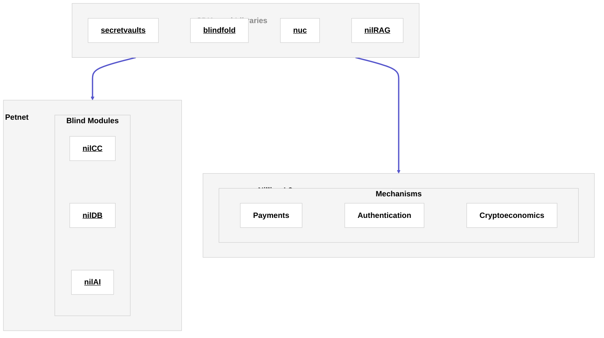

# Architecture

The architecture of the blind computer is geared towards enabling, supporting, enhancing, and monitoring web-compatible apps and workflows that incorporate privacy-enhancing technologies (PETs).

## Overview and Components

When using the blind computer, developers rely on two components: the **Petnet** and **Nillion's L2**. The Petnet allows builders to leverage privacy-enhancing technologies (PETs) to store and compute over data while it remains encrypted. Nillion's L2 enables payments and incentivizes node participation.

 

Developers can interact with each network component either directly via its [corresponding APIs](/api/overview) or via SDKs and libraries (such as those that support [private compute](/blind-computer/build/compute/overview), [private storage](/blind-computer/build/storage/overview) and [private LLMs](/blind-computer/build/llms/overview)).

### Petnet

The Petnet consists of a network of independent nodes that can be recruited into clusters by builders (depending on which PET they employ). Developers have the power to pick their own point on the secure computation trade-off space and to decide what matters to them.

The Petnet nodes support secure storage and computation over data, and these capabilities can be leveraged using the variety of SDKs that can be used to interact with the nodes. Each node supports the use of PETs by operating one or more [blind modules](/blind-computer/learn/blind-modules).

### Nillion L2

Nillion's Ethereum L2 is an EVM-compatible Layer 2 network. It manages shared resources, payments, rewards, and cryptoeconomic staking. Its main purpose is to enable coordination and [verification](/blacklight/learn/overview) of the blind computer.

## Guiding Assumptions and Design Principles

The architecture of the blind computer is informed by a [pragmatic perspective](/articles/nillion-network-architecture) that [acknowledges the realities](/articles/nillion-network-architecture#guiding-assumptions) that PETs infrastructure components and software artifacts inhabit today: apps are likely to use a combination of different PETs, product-market fit of PETs is difficult to predict today, and incentive mechanisms for deploying PETs are not yet mature. This leads to an [emphasis on three design principles](/articles/nillion-network-architecture#interoperability-modularity-and-portability) throughout the architecture: interoperability, modularity, and portability.
