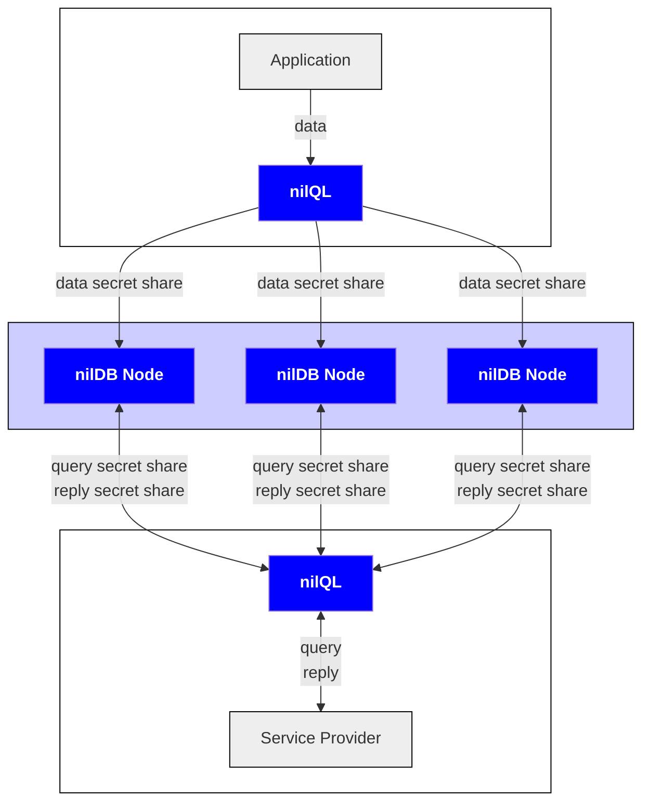
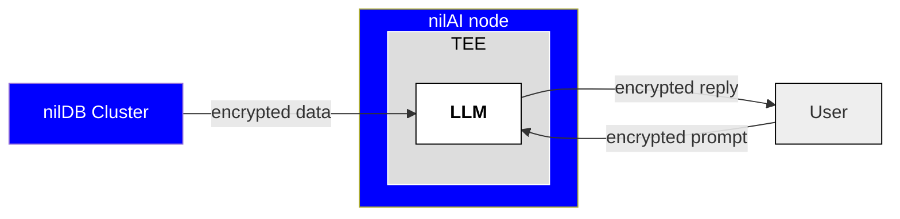
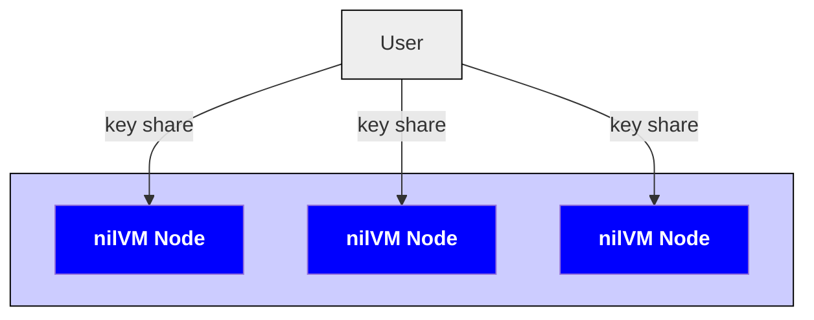
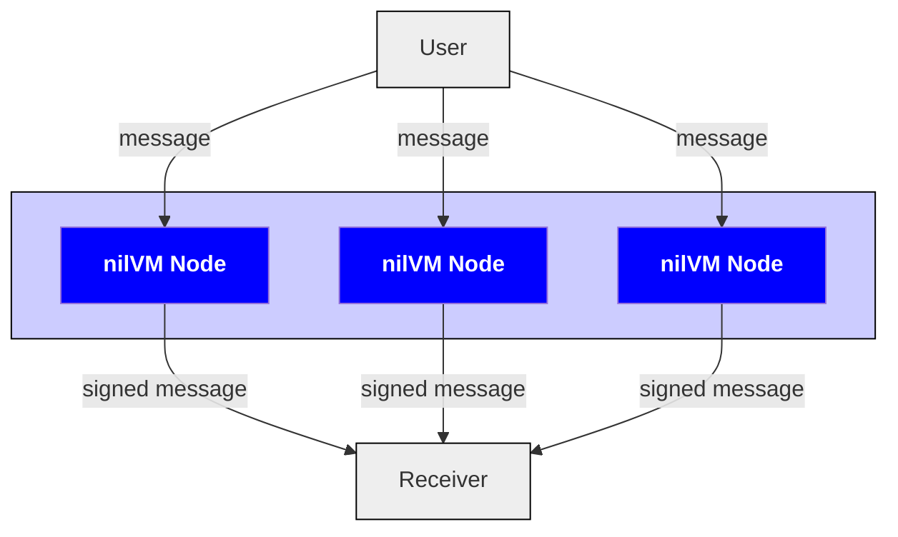

# Blind Modules

Blind Modules are the core technology Nillion is building. As a developer or end user of Nillion's technology, you will mainly interact with the SecretSDKs, which are all built on top of our Blind Modules.

Currently, there are three Blind Modules: nilVM, nilDB & nilAI.

## nilDB

nilDB is Nillion's secure database solution, enabling data to be stored in an encrypted (via symmetric cryptography or HE) and/or decentralized (via MPC) way. Data is stored on a cluster of network nodes (with the current cluster consisting of three nodes).

nilDB is the Blind Module that underpins Nillion's SecretVault and SecretDataAnalytics products. [SecretVault](./secret-vault) and [SecretDataAnalytics](./secret-data-analytics) data are accessed via an easy-to-use RESTful API with endpoints to create/upload, retrieve, and query data. Developers can use our nilQL library to encrypt and/or secret share data on the client side before using our RESTful API to send the ciphertexts and/or secret shares to the nodes.

## nilAI

nilAI is Nillion's secure AI offering, which runs LLMs securely inside TEEs. nilAI is the Blind Module that underpins [SecretLLM](/build/secretLLM/overview).

Like SecretVault and SecretDataAnalytics, this SDK can be accessed via an easy-to-use RESTful API that allows users to run inference using supported models.

## nilVM

The core functionality provided by nilVM is the ability to sign data in a decentralized way using MPC, which can be leveraged using [SecretSigner](/build/secretSigner/overview).

nilVM can also be leveraged using our [Python](/python-client) or [TypeScript](/js-client) clients and includes the [Nada programming language](/nada-lang). Check out full nilVM docs including older [nilVM Quickstarts](/start-building).
