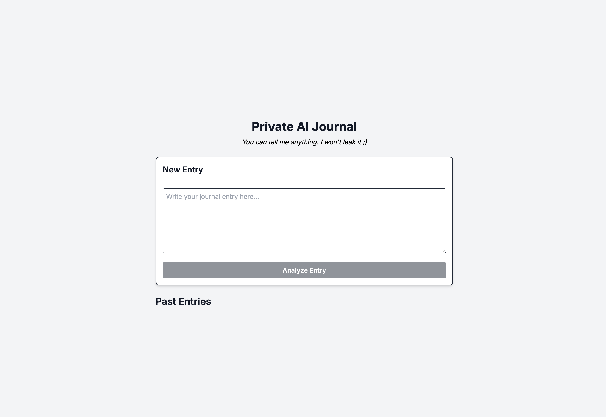

# SecretLLM Quickstart

SecretLLM allows you to run AI models within a Trusted Execution Environment (TEE). You can use SecretLLM to build new private AI applications or migrate existing ones to run in a secure SecretLLM environment where your data remains private.

## Getting Started

<iframe 
  width="100%" 
  height="500" 
  src="https://www.youtube.com/embed/f0EMmEUhFcM" 
  title="YouTube video player" 
  frameborder="0" 
  allow="accelerometer; autoplay; clipboard-write; encrypted-media; gyroscope; picture-in-picture" 
  allowfullscreen>
</iframe>

In this quickstart, we will be making a private AI journaling application with nextjs. Let's get started by cloning our examples repo.

```
git clone gh repo clone NillionNetwork/blind-module-examples
cd blind-module-examples/nilai/secretllm_nextjs
```

## Authentication

Create a SecretLLM API key from [here.](./access.md) It requires either a Keplr or Metamask wallet. Then copy your `.env.example` into your `.env` file

```
cp .env.example .env
```

Then replace it with the API Key you created from the access page.

## Usage

The two main pages that are relevant are `page.tsx` and `api/chat/route.ts`. `page.tsx` hosts the home content which we will refactor and calls the `api/chat` endpoint. The chat endpoint is very simple and adheres to OpenAI API specs for chat completion

You can use the code as it is and test text input to see how the AI responds. You can also customize the types of models you want to use. Current available models are listed [here.](./overview#available-models)

```typescript reference showGithubLink
https://github.com/NillionNetwork/blind-module-examples/blob/main/nilai/secretllm_nextjs/app/api/chat/route.ts
```

## Customization of UI

With your new API key, you should be able to interact and talk to the SecretLLM with the current UI. In order to interact with a new interface for the journal UI, we will just simple useState and then then call the SecretLLM API to retrieve the data.

You may use the content from this page on your page.tsx and then customize the application as you wish.

The current prompt for the AI journal response is:

```
 content: `For this journal entry: "${journalEntry}", respond with ONE sentence starting with " followed by either "You" or "Your". Focus on stoic virtues (resilience, gratitude, growth, self-control, wisdom). Must be similar in length to: "Analysis: You demonstrated resilience and a stoic mindset by focusing on what's within your control."`,
```

```typescript reference showGithubLink
https://github.com/NillionNetwork/blind-module-examples/blob/main/nilai/secretllm_nextjs/app/tutorial_page.tsx
```


