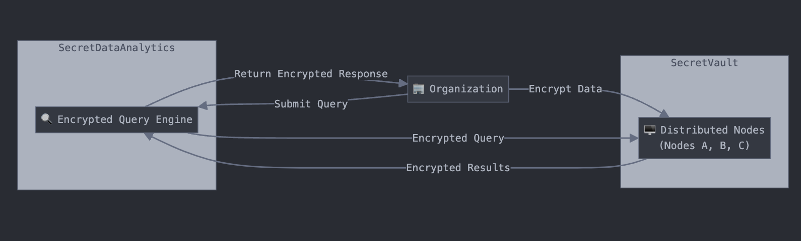

# Overview

Securely store your data with **SecretVault** + run secure queries and computations on them with **SecretDataAnalytics**.

- **SecretVault**: Use Nillion's encryption libraries to secret share your data across our decentralised network of nodes to store and retrieve it using Nillion's easy to use RESTful API
- **SecretDataAnalytics**: Run encrypted queries across your data stored in the SecretVault using our easy to use RESTful API, with Nillion's decryption libraries to reconstruct the result.

# Getting Started

Let's get started with SecretVault and SecretDataAnalytics in a few steps!

To make it easier for you, we have a publicly available shared organization with a pre-defined schema and queries that anyone can use to securely store and then query some test data. This is accessible here with an OpenAPI Swagger interface for `/data/create` and `/queries/execute`.

# Access

:::info

If you are on this page, you can skip this step.
:::

In order to use SecretVault/SecretDataAnalytics with your own schemas and queries, please fill in this form.

Our requirements are to:

- Provide details on how you're planning to use them and your goals.
- Provide detailed representation of the schemas and queries you'll need in JSON schema format. Please make sure they are valid by using tools like [JSON Schema Validator](https://www.jsonschemavalidator.net/).

You will hear back from us if your applications is approved or feedback is required, and you can then proceed with registering.

# Self-Registering

1. After your application is approved, you will receive a link from us to self-register your org
2. **[TEMP]** This is temporarily hosted here XXX for visibility and testing. This should not be in the final docs, as only approved orgs/builders should be able to register. We do not want that page to be public.
3. Here you'll be able to choose a name for your org and select the SecretVault/SecretDataAnalytics nodes that you'd like to deploy to.
4. You will receive and be prompted to securely store your newly created **Credentials** in the form of:
   - A DID (Decentralized Identifier)
   - A private/public keypair
5. Please note that you are solely responsible for keeping your credentials safe and available. We will not be able to retrieve/regenerate them for you, and you will very likely not be able to access your data without these.
6. You will also get a **Cluster Config** describing the nodes that you picked in the form of each nodes:
   - URL
   - DID (Decentralized Identifier)
   - Public key
7. At this stage you should forward us your new DID (from your Credentials), so we can move ahead with registering your schemas and queries as you described them in your application. You can review them using the GET `/schemas` and GET `/queries` endpoints (detailed information in the API Reference page).
