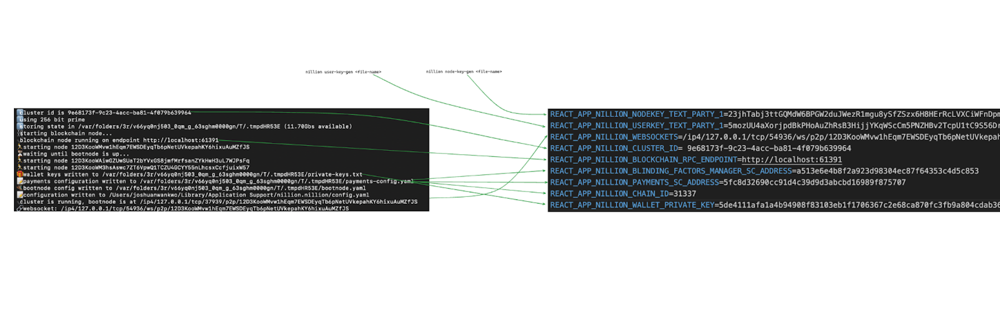

# How to store a secret with the JavaScript Client


Nillion is a blind compute network that allows for secure, decentralized computations without exposing the underlying data. This innovative approach provides a robust solution for privacy-preserving applications.

In this tutorial, you'll learn how to store a secret on Nillion using its JavaScript client, leveraging its unique capabilities to ensure your data remains confidential and tamper-proof.

# Prerequisites

1. Install node version 18.17 or higher.
2. Install [Foundry](https://book.getfoundry.sh/getting-started/installation). After installation, use the **`foundryup`** command to install the binaries, including Anvil.
3. Have Nillion installed. You can check out this [guide](https://docs.nillion.com/nillion-sdk-and-tools).
    
    Optionally, you can set up [instrumentation](https://docs.nillion.com/nillion-sdk-and-tools) after installing Nillion and you can do so by running the following command: 
    
    ```jsx
    nilup instrumentation enable --wallet quest-<your-eth-wallet-address>
    ```
    
4. Basic understanding of JavaScript/TypeScript
5. Have Nillion SDK installed on your machine. You can check out this [guide](https://docs.nillion.com/js-client) to learn more.

# Run Devnet locally

Once you have all the necessary tools installed and you’ve confirmed that Nillion is installed, open a new terminal and run the following command.

```jsx
nillion-devnet
```

This will spin up a network of Nillion nodes locally on your machine.


# Setup your React typescript project

In this guide we’re going to be working with React Typescript. So install and set your react typescript project, you can do that by running the following command:

// npx create-react-app <project-name>  --template typescript

After the project creation, please go ahead and delete the boilerplate code because we’re note going to be needing them.

# Set COOP and COEP Headers

Nillion’s JavaScript Client utilizes browser web workers. To ensure your application is cross-origin isolated, you need to set the following headers:

```jsx
Cross-Origin-Embedder-Policy: require-corp

Cross-Origin-Opener-Policy: same-origin
```

To do that you need to create a file name setUpProxy in your src directory and paste in the following code.

```jsx
module.exports = function (app) {
  app.use(function (res, next) {
    res.setHeader("Cross-Origin-Opener-Policy", "same-origin");
    res.setHeader("Cross-Origin-Embedder-Policy", "require-corp");
    next();
  });
};

```

# Create .env file

Next you need to create a .env file, this is where all the important keys you need to setup your configuration is going to be.

```jsx
REACT_APP_NILLION_NODEKEY_TEXT_PARTY_1=23jhTabj3ttGQMdW6BPGW2duJWezR1mgu8ySfZSzx6H8HErRcLVXCiWFnDpmeqL7gcbcAdUPseNoqNWev5ixNayQWTA2Y

REACT_APP_NILLION_USERKEY_TEXT_PARTY_1=5mozUU4aXorjpdBkPHoAuZhRsB3HijjYKqWScCm5PNZHBv2TcpU1tC9S56DrnMbuzM1s3uKskW24TEtj5Gfr5xUB

REACT_APP_NILLION_WEBSOCKETS=/ip4/127.0.0.1/tcp/54936/ws/p2p/12D3KooWMvw1hEqm7EWSDEyqTb6pNetUVkepahKY6hixuAuMZfJS

REACT_APP_NILLION_CLUSTER_ID= 9e68173f-9c23-4acc-ba81-4f079b639964

REACT_APP_NILLION_BLOCKCHAIN_RPC_ENDPOINT=http://localhost:61391

REACT_APP_NILLION_BLINDING_FACTORS_MANAGER_SC_ADDRESS=a513e6e4b8f2a923d98304ec87f64353c4d5c853

REACT_APP_NILLION_PAYMENTS_SC_ADDRESS=5fc8d32690cc91d4c39d9d3abcbd16989f875707

REACT_APP_NILLION_CHAIN_ID=31337

REACT_APP_NILLION_WALLET_PRIVATE_KEY=5de4111afa1a4b94908f83103eb1f1706367c2e68ca870fc3fb9a804cdab365a
```

this part can be a little tricky because you might not know exactly where to get all the value for environmental variables, don’t worry about that, I’m going to walk you through how to do that in a bit.

# Configure Nillion

Now we need to set up our Nillion configuration file, while you can do this inside your main app, it’s advised to have the configuration code inside a separate file, that way you have a cleaner code and it makes your project easier to maintain.

Inside your src directory, create a config.ts file and paste in the following code

```jsx
export const nillionConfig = {
  websockets: process.env.REACT_APP_NILLION_WEBSOCKETS,
  cluster_id: process.env.REACT_APP_NILLION_CLUSTER_ID,
  user_key: process.env.REACT_APP_NILLION_USERKEY_TEXT_PARTY_1,
  node_key: process.env.REACT_APP_NILLION_NODEKEY_TEXT_PARTY_1,
  payments_config: {
    rpc_endpoint: process.env.REACT_APP_NILLION_BLOCKCHAIN_RPC_ENDPOINT,
    smart_contract_addresses: {
      blinding_factors_manager:
        process.env.REACT_APP_NILLION_BLINDING_FACTORS_MANAGER_SC_ADDRESS,
      payments: process.env.REACT_APP_NILLION_PAYMENTS_SC_ADDRESS,
    },
    signer: {
      wallet: {
        // @ts-ignore
        chain_id: parseInt(process.env.REACT_APP_NILLION_CHAIN_ID || 0),
        private_key: process.env.REACT_APP_NILLION_WALLET_PRIVATE_KEY,
      },
    },
  },
};
```

Here you’ll notice that we’re making use of some of the environmental variable we declared earlier in our .env file which brings back the question of where and how do we get those environmental variables.

# Environmental Variables

The environmental variables are in different places, some are in the terminal where you spinned up your Nillion Devnet while some are in hidden files somewhere on your machine.

Below is a diagram of the env file and where you can find the values.



- REACT_APP_Nillion_NODEKEY_TEXT_PARTY_1: You can get this by running the following command: Nillion node-key-gen <filename>, the file is going to get generated and save to your root directory.
- REACT_APP_Nillion_USERKEY_TEXT_PARTY_1: You can get this by running the following command: Nillion user-key-gen <filename>, the file is going to get generated and save to your root directory.
- REACT_APP_Nillion_WEBSOCKETS: This can be found in your terminal once your Nillion Devnet is up and running, you can reference the image above to see exactly where it is.
- REACT_APP_Nillion_CLUSTER_ID: You can find this in your terminal too once your Nillion is up and running, also reference the diagram above to see exactly where it is.
- REACT_APP_Nillion_BLOCKCHAIN_RPC_ENDPOINT: Just like the two mentioned values above, this one two can be found in your terminal, also reference the above diagram to see exactly where.
- REACT_APP_Nillion_BLINDING_FACTORS_MANAGER_SC_ADDRESS: This can be found inside the payment config file in the directory where the terminal is pointing to, once you get to the file, open it using any text editor and you should be able to see the value there.
- REACT_APP_Nillion_PAYMENTS_SC_ADDRESS: Just like the last one, this can also be found in the directory the terminal is pointing to, you can reference the above diagram to find out exactly where in your pc it is located.
- REACT_APP_Nillion_CHAIN_ID: The chain ID can also be found in the same file just like the previous two values, reference the diagram above.
- REACT_APP_Nillion_WALLET_PRIVATE_KEY: The private key is stored in a separate file but still in the same directory, the above diagram should help you understand where it is stored on your pc.

# Utility Function

Now that we have all the environment variables sorted out, let’s dive straight into writing our storeSecret function, for this we’re going to create a utils file inside our src directory, you can write this function inside your main app but I having a separate file for your utility functions helps with making your code cleaner and easier to manage.

The first thing we’re going to do inside the file we just created is to import the NillionConfig we created earlier and also create an interface for our function parameters.

```jsx
import { NillionConfig } from "./NillionConfig";

interface JsInput {
 name: string;
 value: string;
}

```

After that  we’re just going to go ahead and write the function

```jsx
export async function storeSecretsBlob(
 Nillion: any,
 NillionClient: any,
 secretsToStore: JsInput[]
): Promise<string> {
 try {
   // create secrets object
   const secrets = new Nillion.Secrets();

   // iterate through secretsToStore, inserting each into the secrets object
   for (const secret of secretsToStore) {
     // encodes secret as a byteArray
     const byteArraySecret = new TextEncoder().encode(secret.value);

     // create new SecretBlob with encoded secret
     const newSecret = Nillion.Secret.new_blob(byteArraySecret);

     // insert the secret into secrets object
     secrets.insert(secret.name, newSecret);
   }

   // store secrets with permissions
   const store_id = await NillionClient.store_secrets(
     NillionConfig.cluster_id,
     secrets
   );
   return store_id;
 } catch (error) {
   console.log(error);
   return "error";
 }
}
```

Here we’re creating a function name “storeSecretBlob”, this function accepts three parameters which are, an instance of Nillion network, an instance of Nillion javascript client and then the secret we want to store.

Inside our storeSecretBlob function, first thing we do is to create a new instance of of Nillion secret object, then we iterate through the array of secret(s) we want to store and for each of them, we encode the secret to byteArray, create a new instance of Nillion secret blob and pass in the byte array we just created and then pass the blob into the Nillion secret object we created earlier. Now we have our secret prepared we then store the secret on Nillion network using NillionClient.store_secret and then pass in the cluster id of the local network we have running and the secret we want to store, this function returns the store ID and it is important we store the secret ID somewhere because we are going to need it whenever we want to retrieve the secret from the network.

# Web App

We have gathered all the pieces we need and what is left now is to assemble everything together into an app that we can interact with. How you choose to build this part is entirely dependent on you and your own specific project requirements, however if you understand what we did here, you can replicate it in any other javascript application. Alright, back to coding!

## Import dependencies

```jsx
import { useEffect, useState } from "react";
import "./App.css";
import { storeSecretsBlob } from "./utils";
import * as NillionClient from "@nillion/nillion-client-js-browser";
import { nillionConfig } from "./nillionConfig";
```

First we need to import the useEffect for running some code as soon as our page loads, useState for managing state in our application.

Next we import the storeSecretBlob that we wrote in our utils file, we import NillionClient and nillionConfig object because we’re still going to need it here to interact with the devnet running locally on our machine.

## App state

```jsx
 const [nillion, setNillion] = useState<typeof NillionClient | null>(null);
 const [newSecret, setNewSecret] = useState("");
 const [secretName, setSecretName] = useState("");
 const [storeID, setStoreID] = useState("");
 const [nillionClient, setNillionClient] = useState<NillionClient.NillionClient | null>(null);
```

We’re managing the state of our application with this part of the code, we use these states to run operations and also render some of the results to the UI.

## useEffects

```jsx
useEffect(() => {
   const importNillion = async () => {
     try {
       const nillionPackage = await import(
         "@nillion/nillion-client-js-browser"
       );
       setNillion(nillionPackage);
     } catch (err) {
       console.error("Error importing Nillion client:", err);
     }
   };
   importNillion();
 }, []);
```

Here we have our first useEffect which is simple importing Nillion JavScript SDK and setting it to our nillion state, this give us access to all the prewritten function so we can (continue this part later)

```jsx
 useEffect(() => {
   if (nillion) {
     const initializeNillionClient = async () => {
       try {
         await nillion.default();

         const node_key = nillion.NodeKey.from_base58(
           nillionConfig.node_key || ""
         );
         const user_key = nillion.UserKey.from_base58(
           nillionConfig.user_key || ""
         );
         const bootnodes_web = [nillionConfig.websockets || ""];
         const paymentsConfig = nillionConfig.payments_config;

         // create new instance of NillionClient
         const client = new nillion.NillionClient(
           user_key,
           node_key,
           bootnodes_web,
           paymentsConfig
         );

         // set state access to nillionClient
         setNillionClient(client);
       } catch (err) {
         console.error("Error initializing Nillion client:", err);
       }
     };
     // initialize client if it doesn't exist yet
     if (!nillionClient) {
       initializeNillionClient();
     }
   }
 }, [nillion, nillionClient]);
```

Our second useEffect is importing our node key, user key, websocket and payment config from our nillionConfig file, it uses all this information to create an instance of NillionClient and then sets it to our NillionClient state.

## storeSecret Function

```jsx
const storeSecret = async () => {
   const result = await storeSecretsBlob(nillion, nillionClient, [
     { name: secretName, value: newSecret },
   ]);
   setStoreID(result);
 };
```

This is the function for storing our secret, we have already written the function in our utils file and here we’re just calling the function, passing in the parameters and then setting the result which is the storeID to our storeID state so that we can save it and use it later.

## User interface

```jsx
   <div>
        <h2>Store Secret</h2>
         <input
           type="text"
           onChange={(e) => setNewSecret(e.target.value)}
           placeholder="Enter new secret"
          />
          <input
	          type="text"
            onChange={(e) => setSecretName(e.target.value)}
            placeholder="Enter secret name"
          />
          <h6>Store Id: {storeID}</h6>
         <button onClick={() => storeSecret()}>Store Secret</button>
   </div>
```

Here we have a simple user interface with just two inputs, the first input takes the secret we want to store as text, the second one takes the name we want to save our secret as, it is important you remember the name or save it somewhere you can easily find it because you’re going to need it to when you want to retrieve the secret.

We also have a h6 tag for displaying the storeID once it is returned and lastly we have a button that runs the store function when we click on it.

You can modify your user interface and user experience to fit into the needs of your application, also remember to do proper error handling.

## Complete code

You can expand this section to see what the full UI code looks like

- Complete UI code
    
    ```jsx
    import { useEffect, useState } from "react";
    import "./App.css";
    import { storeSecretsBlob } from "./utils";
    import * as NillionClient from "@nillion/nillion-client-js-browser";
    import { nillionConfig } from "./nillionConfig";
    
    function App() {
     const [nillion, setNillion] = useState<typeof NillionClient | null>(null);
     const [newSecret, setNewSecret] = useState("");
     const [secretName, setSecretName] = useState("");
     const [storeID, setStoreID] = useState("");
     const [nillionClient, setNillionClient] =
       useState<NillionClient.NillionClient | null>(null);
    
     useEffect(() => {
       const importNillion = async () => {
         try {
           const nillionPackage = await import(
             "@nillion/nillion-client-js-browser"
           );
           setNillion(nillionPackage);
         } catch (err) {
           console.error("Error importing Nillion client:", err);
         }
       };
       importNillion();
     }, []);
    
     useEffect(() => {
       if (nillion) {
         const initializeNillionClient = async () => {
           try {
             await nillion.default();
    
             const node_key = nillion.NodeKey.from_base58(
               nillionConfig.node_key || ""
             );
             const user_key = nillion.UserKey.from_base58(
               nillionConfig.user_key || ""
             );
             const bootnodes_web = [nillionConfig.websockets || ""];
             const paymentsConfig = nillionConfig.payments_config;
    
             // create new instance of NillionClient
             const client = new nillion.NillionClient(
               user_key,
               node_key,
               bootnodes_web,
               paymentsConfig
             );
    
             // set state access to nillionClient
             setNillionClient(client);
           } catch (err) {
             console.error("Error initializing Nillion client:", err);
           }
         };
         // initialize client if it doesn't exist yet
         if (!nillionClient) {
           initializeNillionClient();
         }
       }
     }, [nillion, nillionClient]);
    
     const storeSecret = async () => {
       const result = await storeSecretsBlob(nillion, nillionClient, [
         { name: secretName, value: newSecret },
       ]);
       setStoreID(result);
     };
    
     return (
             <div>
               <h2>Store Secret</h2>
               <input
                 type="text"
                 onChange={(e) => setNewSecret(e.target.value)}
                 placeholder="Enter new secret"
               />
               <input
                 type="text"
                 onChange={(e) => setSecretName(e.target.value)}
                 placeholder="Enter secret name"
               />
               <h6>Store Id: {storeID}</h6>
               <button onClick={() => storeSecret()}>Store Secret</button>
             </div>
     
     );
    }
    
    export default App;
    
    ```
    

# Conclusion

By following this tutorial, you now have a foundational understanding of how to store secrets using Nillion's JavaScript client. We walked through setting up a local Nillion Devnet, configuring environment variables, and integrating these elements into a React TypeScript project to securely store secrets.

If you wish to learn more about Nillion Network, here are some resources:

- [Nillion documentation](https://docs.nillion.com/)
- [Nillion JavaScript client](https://docs.nillion.com/js-client)
- [Storing a secret with Nillion’s JavaScript client](https://docs.nillion.com/store-secrets-js)
- [Nillion forum](https://www.nillhub.com/)
- [Nillion GitHub repository](https://github.com/NillionNetwork)