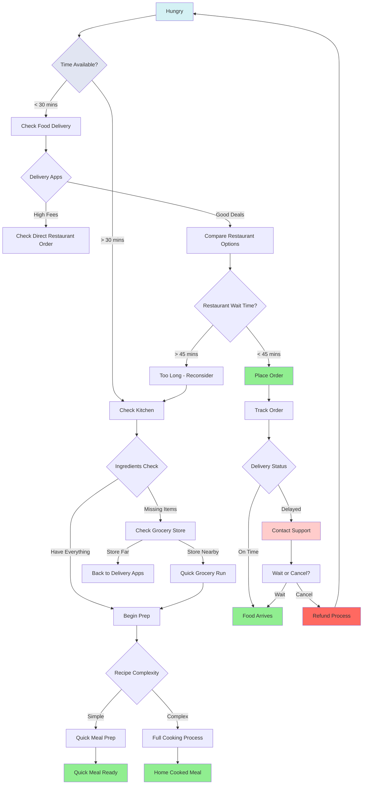

# Architecture

The Nillion Network architecture consists of two main components: the Petnet and nilChain. The Petnet allows builders to leverage privacy-enhancing technologies (PETs) to store and compute over data while it remains encrypted. The nilChain enables payments and incentivizes participation in the Nillion Network.

## Petnet

The Petnet consists of a network of nodes that can be recruited into clusters by builders (depending on which PET they employ). Developers have the power to pick their own point on the secure computation trade-off space and to decide what matters to them.

The Petnet nodes support secure storage and computation over data, and these capabilities can be leveraged using the variety of SDKs that can be used to interact with the nodes. Each node supports the use of PETs by operating one or more [Blind Modules](/build/blind-modules).

## nilChain

The nilChain is a blockchain that manages shared resources for the whole Nillion Network. It's built on top of the Cosmos SDK stack and supports rewards, cryptoeconomic stake, and governance, as well as enabling inter-cluster coordination. Since its main purpose is to enable coordination, the chain does not have an open execution environment for running smart contracts.

### Mermaid Diagram

