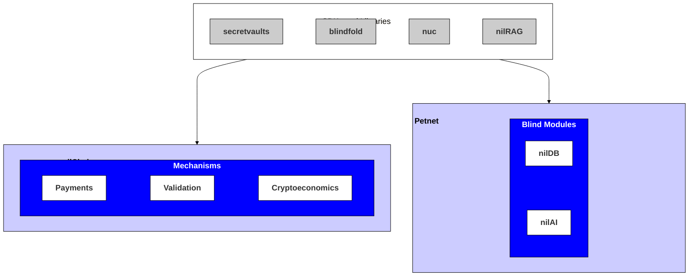

# Architecture

The architecture of the Nillion Network is geared towards enabling, supporting, enhancing, and monitoring web-compatible apps and workflows that incorporate privacy-enhancing technologies (PETs).

## Overview and Components

The Nillion Network architecture consists of two main components: the **nilChain** and the **Petnet**. The nilChain enables payments and incentivizes participation in the Nillion Network. The Petnet allows builders to leverage privacy-enhancing technologies (PETs) to store and compute over data while it remains encrypted.

 

Developers can interact with the various node types found in each network component either directly via their [corresponding APIs](/api/overview) or via the SDKs and libraries that support [Private Storage](/build/private-storage/overview) and [Private LLMs](/build/private-llms/overview).

### nilChain

The nilChain is a blockchain that manages shared resources for the whole Nillion Network. It's built on top of the Cosmos SDK stack and supports payments, rewards, and cryptoeconomic staking. The main purpose of nilChain is to enable coordination, so it does not have an open execution environment for running smart contracts.

### Petnet

The Petnet consists of a network of nodes that can be recruited into clusters by builders (depending on which PET they employ). Developers have the power to pick their own point on the secure computation trade-off space and to decide what matters to them.

The Petnet nodes support secure storage and computation over data, and these capabilities can be leveraged using the variety of SDKs that can be used to interact with the nodes. Each node supports the use of PETs by operating one or more [Blind Modules](/learn/blind-modules).

## Guiding Assumptions

The architecture of the Nillion Network is informed by a pragmatic perspective that acknowledges the realities that PETs infrastructure components and software artifacts inhabit today.

* Most apps use a combination of frameworks and services that best suit their target problem, and these almost always come from a number of incumbent and up-and-coming providers.

* It is difficult to predict today which PET components and features (or combinations thereof) will ultimately achieve product-market fit once PETs are ubiquitous.

* Incentive mechanisms for PETs throughout the industry are not yet mature and so it is not known who (user, app developer and service provider, or third-party node operator) will run PETs software or maintain PETs infrastructure.

## Principles and Philosophy

The guiding assumptions motivate a strong commitment to three principles in the design and development of the Nillion Network.

* **Interoperability:** The languages, dependencies, and interfaces are chosen from among the most common and popular in contemporary app development (even if this comes at the expense of performance). This includes starting with Python and JavaScript/TypeScript SDKs, a NoSQL storage solution, REST APIs for all components, and so on. Developers should encounter as few obstacles as possible incorporating a PET feature into a typical stack (especially if they are incorporating only a single feature and/or using it in tandem with other solutions).

* **Modularity:** Interdependencies between libraries/SDKs and infrastructure are kept to a minimum both within layers and between them. We can illustrate both by considering storage of encrypted data within [nilDB](/build/private-storage/overview). The [blindfold](/build/private-storage/blindfold) library offers a number of encryption techniques, and any single technique can be used while ignoring the others. Furthermore, every available technique is compatible with nilDB nodes that are entirely independent of one another: no node necessarily needs to know the method of encryption or about which other nodes may be involved in a protocol.

* **Portability:** The available functionalities and components are compatible with a number of stacks. Python and JavaScript/TypeScript SDKs and libraries accommodate both server-side and client-side app architectures, and containerization ensures that both service providers and third parties can operate nodes.

While ensuring that infrastructure and software are decentralized and incentivized can be a standalone goal, it is worth noting that following the above three principles naturally leads to decentralization. In particular, it is easier to find and incentivize distinct kinds of operators (users with client devices, service providers, or third-party node operators) for each highly specialized modular component, with the component’s portability providing flexibility in finding the best operator-component fit.
