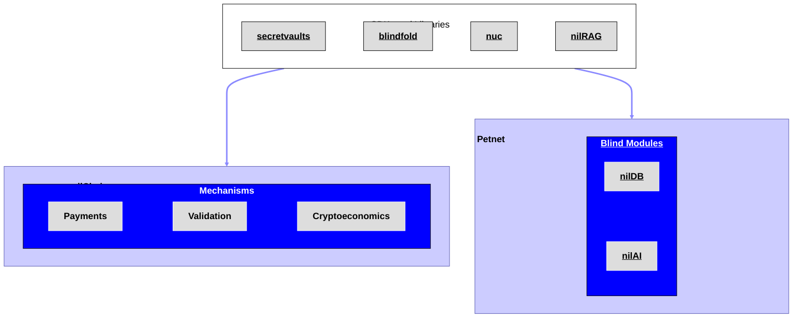

# Architecture

The architecture of the Nillion Network is geared towards enabling, supporting, enhancing, and monitoring web-compatible apps and workflows that incorporate privacy-enhancing technologies (PETs).

## Overview and Components

The Nillion Network architecture consists of two main components: the **nilChain** and the **Petnet**. The nilChain enables payments and incentivizes participation in the Nillion Network. The Petnet allows builders to leverage privacy-enhancing technologies (PETs) to store and compute over data while it remains encrypted.

 

Developers can interact with the various node types found in each network component either directly via their [corresponding APIs](/api/overview) or via the SDKs and libraries that support [Private Storage](/build/private-storage/overview) and [Private LLMs](/build/private-llms/overview).

### nilChain

The nilChain is a blockchain that manages shared resources for the whole Nillion Network. It's built on top of the Cosmos SDK stack and supports payments, rewards, and cryptoeconomic staking. The main purpose of nilChain is to enable coordination, so it does not have an open execution environment for running smart contracts.

### Petnet

The Petnet consists of a network of nodes that can be recruited into clusters by builders (depending on which PET they employ). Developers have the power to pick their own point on the secure computation trade-off space and to decide what matters to them.

The Petnet nodes support secure storage and computation over data, and these capabilities can be leveraged using the variety of SDKs that can be used to interact with the nodes. Each node supports the use of PETs by operating one or more [Blind Modules](/learn/blind-modules).

## Guiding Assumptions and Design Principles

The architecture of the Nillion Network is informed by a [pragmatic perspective](/articles/nillion-network-architecture) that [acknowledges the realities](/articles/nillion-network-architecture#guiding-assumptions) that PETs infrastructure components and software artifacts inhabit today: apps are likely to use a combination of different PETs, product-market fit of PETs is difficult to predict today, and incentive mechanisms for deploying PETs are not yet mature. This leads to an [emphasis on three design principles](/articles/nillion-network-architecture#interoperability-modularity-and-portability) throughout the architecture: interoperability, modularity, and portability.
