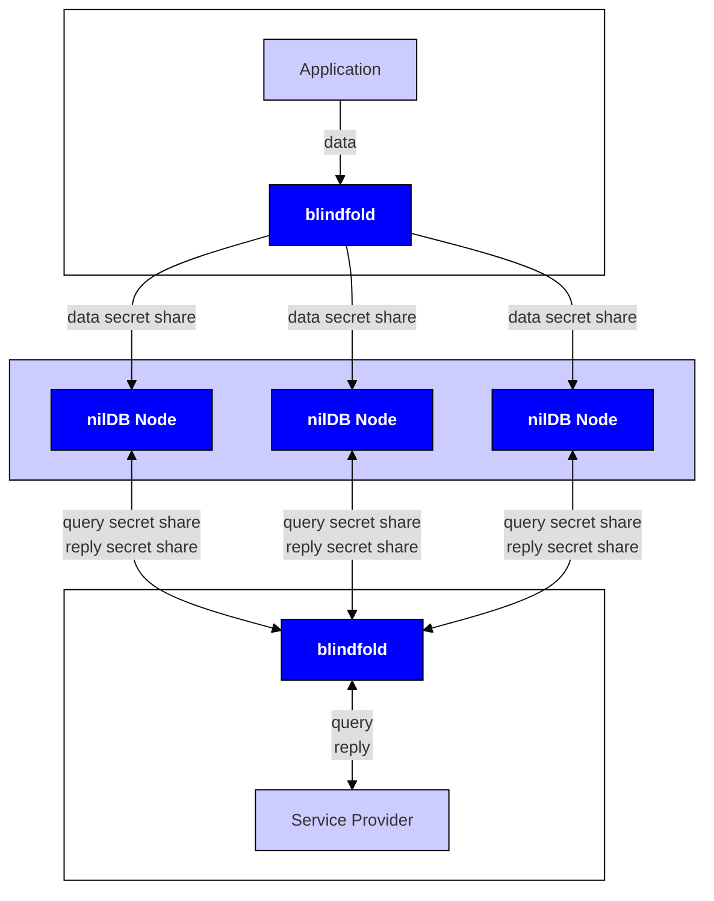
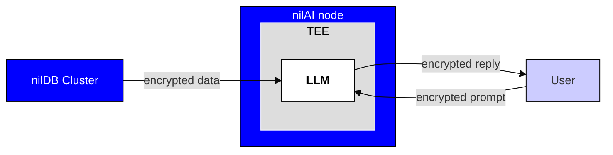

# Blind Modules

Blind Modules are the core technical components of the Nillion Network. Developers and end users of Nillion's technology mainly interact with Blind Modules via SDKs, but also have the option of interacting with them directly via their [APIs](/api/overview).

## nilDB

nilDB is Nillion's secure [NoSQL](https://en.wikipedia.org/wiki/NoSQL) database solution, enabling data to be stored in an encrypted (via symmetric cryptography or HE) and/or decentralized (via MPC) way. Developers are free to treat any combination of one or more nilDB nodes as a cluster. Documents containing a mix of encrypted and plaintext values can be stored in such a cluster. The diagram below illustrates typical storage and query flows involving a cluster of three nodes.

nilDB is the Blind Module that underpins Nillion's [Private Storage](/build/private-storage/overview) solutions. When using nilDB directly, data is accessed via an easy-to-use RESTful API with endpoints to create/upload, retrieve, and query data. Developers can use the [blindfold library](/build/private-storage/blindfold) to encrypt and/or secret share data on the client side before using the [RESTful API](/api/nildb/overview) to send the ciphertexts and/or secret shares to the nodes.

## nilAI

nilAI is Nillion's secure AI offering, which runs LLMs securely inside TEEs. nilAI is the Blind Module that underpins Nillion's [Private LLMs](/build/private-llms/overview) solutions.

The nilAI Blind Module can be accessed via an [easy-to-use RESTful API](/api/nilai/overview) that allows users to run inference using supported models.
