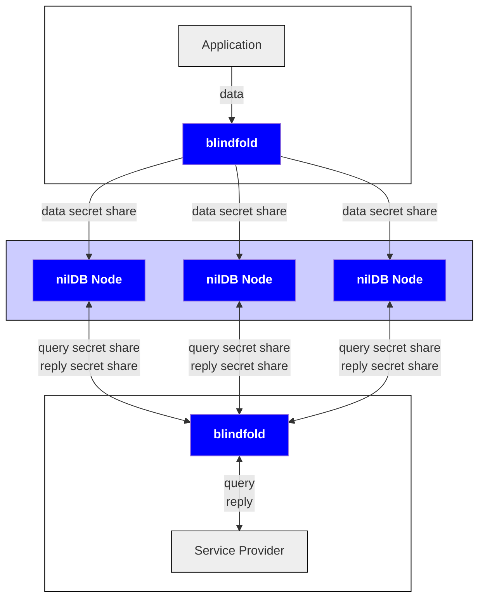
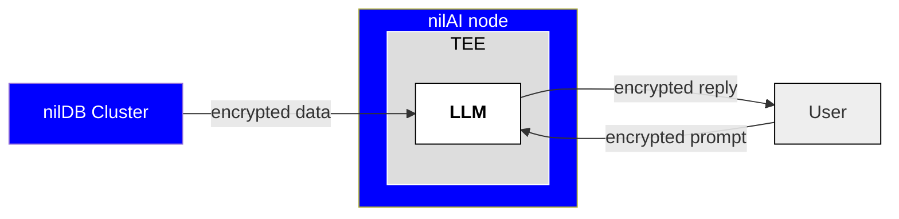

# Blind Modules

Blind Modules are the core technology Nillion is building. As a developer or end user of Nillion's technology, you will mainly interact with the SecretSDKs, which are all built on top of our Blind Modules: nilDB and nilAI.

## nilDB

nilDB is Nillion's secure database solution, enabling data to be stored in an encrypted (via symmetric cryptography or HE) and/or decentralized (via MPC) way. Data is stored on a cluster of network nodes (with the current cluster consisting of three nodes).

nilDB is the Blind Module that underpins Nillion's [Private Storage](/build/private-storage/overview) solutions. When using nilDB, data is accessed via an easy-to-use RESTful API with endpoints to create/upload, retrieve, and query data. Developers can use the [blindfold library](/build/private-storage/blindfold) to encrypt and/or secret share data on the client side before using the RESTful API to send the ciphertexts and/or secret shares to the nodes.

## nilAI

nilAI is Nillion's secure AI offering, which runs LLMs securely inside TEEs. nilAI is the Blind Module that underpins Nillion's [Private LLMs](/build/private-llms/overview) solution.

Like SecretVault and SecretDataAnalytics, this SDK can be accessed via an easy-to-use RESTful API that allows users to run inference using supported models.
